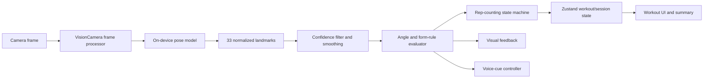
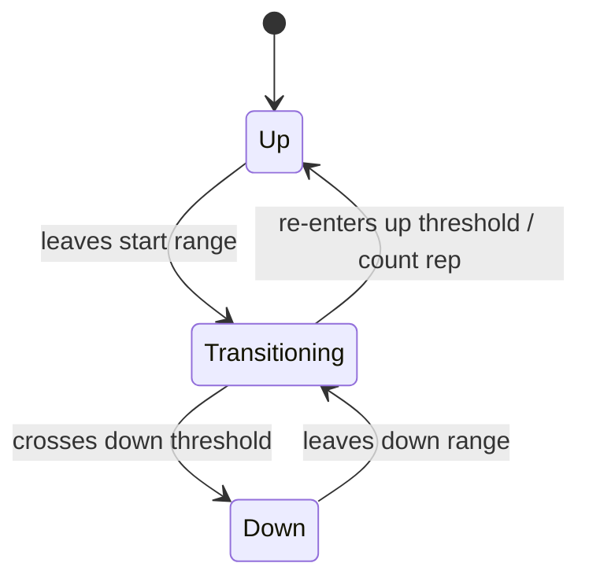

# GYM Pose AI — Implementation Plan

## 1. Goal

Build a React Native (Expo bare/dev-client) mobile app that uses the device camera and an on-device pose model to give real-time visual and voice feedback on exercise form.

V1 focuses only on the reliable live form-correction loop for three exercises:

- Squats
- Push-ups
- Bicep curls

## 2. Scope

### In scope

- Live camera preview and on-device pose detection
- 33 pose landmarks per frame
- Joint-angle calculation and configurable form rules
- Rep counting with hysteresis
- Skeleton overlay and live form feedback
- Voice feedback with cooldowns
- Session summary and optional local workout history

### Out of scope for V1

- Social features
- Cloud sync
- Server-side inference
- AI-generated workout plans

## 3. Technical Architecture

### Stack

- Expo with bare/dev-client workflow (not Expo Go)
- TypeScript
- `expo-router` for navigation
- `react-native-vision-camera` for camera access and frame processors
- MediaPipe Pose Landmarker integration, or `react-native-fast-tflite` as fallback, for local pose inference
- Zustand for workout state
- NativeWind for styles
- `expo-speech` for voice cues
- AsyncStorage or SQLite for local history, after the core workout loop is stable

### Real-time processing pipeline



### Source layout

```text
src/
  app/
    index.tsx
    workout.tsx
    summary.tsx
    history.tsx
  components/
    CameraOverlay.tsx
    SkeletonOverlay.tsx
    FormStatusIndicator.tsx
    RepCounter.tsx
  features/
    pose/
      landmarks.ts
      angleMath.ts
      smoothing.ts
      skeleton.ts
      confidence.ts
    exercises/
      types.ts
      squat.ts
      pushup.ts
      bicepCurl.ts
      evaluator.ts
    workout/
      repCounter.ts
      feedback.ts
      sessionStats.ts
      voiceCues.ts
  store/
    workoutStore.ts
  storage/
    sessionRepository.ts
```

## 4. Implementation Milestones

### Milestone 1 — Foundation and native camera setup

1. Initialise an Expo TypeScript project configured for development builds.
2. Add Expo Router, NativeWind, Zustand and camera permission handling.
3. Create the initial screens:
   - Exercise selection
   - Live workout
   - Session summary
   - History placeholder
4. Install and configure `react-native-vision-camera`.
5. Verify the app runs in an Android/iOS development build and displays the selected camera.

**Acceptance criteria:** A physical device can open the app, grant camera permission and view a live camera preview.

### Milestone 2 — Pose-inference proof of concept

This is the highest-risk milestone and should be completed before building most UI or exercise logic.

1. Evaluate pose backend compatibility with VisionCamera frame processors.
2. Integrate a local pose model:
   - First choice: MediaPipe Pose Landmarker, if it can safely run from the required native/worklet path.
   - Fallback: a TensorFlow Lite pose model through `react-native-fast-tflite`.
3. Process camera frames on a background/worklet path.
4. Convert model output into a common `PoseLandmark[]` shape with `x`, `y`, `z` (if available), and confidence.
5. Log/display landmark availability and processing time during development.
6. Add adaptive frame skipping and frame downscaling where required.

**Acceptance criteria:** The app consistently produces 33 pose landmarks locally while maintaining a responsive camera UI and at least 15 FPS on the target device.

### Milestone 3 — Pose analytics foundation

1. Implement pure TypeScript angle utilities using vector math.
2. Implement landmark confidence validation and "body not detected" state.
3. Add landmark smoothing to reduce noisy frame-by-frame measurements.
4. Create a standard form-evaluation result:

```ts
type FormEvaluation = {
  status: "correct" | "warning" | "incorrect" | "unavailable";
  angles: Record<string, number>;
  errors: FormError[];
  confidence: number;
};
```

5. Build a reusable skeleton topology, connecting landmarks according to the human-body structure.

**Acceptance criteria:** Given saved landmark fixtures, the system calculates expected angles, rejects low-confidence poses and returns deterministic form results.

### Milestone 4 — Config-driven exercise engine

Define exercises as declarative configurations rather than embedding logic directly in screens.

Each exercise configuration contains:

- Name and target muscle group
- Required landmarks and tracked joint angles
- Start and end position angle ranges
- Rep thresholds and hysteresis margins
- Form error checks and severity
- Feedback message and voice-cue key for each error

Illustrative configuration shape:

```ts
type ExerciseConfig = {
  id: "squat" | "pushup" | "bicep-curl";
  name: string;
  muscleGroup: string;
  angles: AngleDefinition[];
  phases: { up: AngleRange; down: AngleRange };
  repThresholds: RepThresholds;
  formChecks: FormCheck[];
};
```

Initial rules:

| Exercise   | Main rep signal        | Initial form checks                               |
| ---------- | ---------------------- | ------------------------------------------------- |
| Squat      | Knee/hip flexion angle | Knee cave, insufficient depth, excess back lean   |
| Push-up    | Elbow flexion angle    | Hip sag/pike, shallow depth, poor elbow alignment |
| Bicep curl | Elbow flexion angle    | Incomplete curl/extension, upper-arm swing        |

**Acceptance criteria:** Adding an exercise normally needs a new config and rule definitions, without modifying the camera pipeline or generic rep counter.

### Milestone 5 — Rep counting

Implement a per-exercise finite state machine:



Rules:

- A rep counts only after `up → down → up` is completed.
- Threshold hysteresis prevents repeated counts near a boundary.
- Low-confidence frames and short/noisy movements must not count as reps.
- Store both `totalReps` and `correctFormReps`.
- Capture error occurrences at rep completion for session analytics.

**Acceptance criteria:** Fixture-based tests prove that partial movements, jitter and repeated threshold crossings do not inflate the rep count.

### Milestone 6 — Live workout experience

1. Add exercise selection grid/list.
2. Display full-screen camera preview for a selected exercise.
3. Render the skeleton above the preview using Canvas or SVG.
4. Change skeleton/status colour based on form state:
   - Green: correct form
   - Yellow: warning / low confidence
   - Red: incorrect form
5. Display live rep total, correct-rep total and current feedback text.
6. Add start, pause and end-session controls.
7. Use a clean empty state when no usable body pose is visible.

**Acceptance criteria:** A user can select an exercise, see their tracked skeleton, receive live form feedback and finish a workout session.

### Milestone 7 — Voice feedback

1. Map high-priority form errors to short Hinglish/Hindi cues, for example:
   - "Knees seedhe rakho"
   - "Peeth seedhi rakho"
   - "Thoda aur neeche jao"
2. Speak only when the active major error changes.
3. Enforce a minimum two-second cooldown.
4. Suppress repeat speech for the same continuing error.
5. Respect the workout pause/end state.

**Acceptance criteria:** Voice advice is helpful and infrequent; it does not repeat on every processed frame.

### Milestone 8 — Session summary and local history

1. Persist session data locally after a workout ends.
2. Build a summary screen containing:
   - Total reps
   - Correct-form reps
   - Correct-form percentage
   - Duration
   - Most frequent mistakes
3. Add an optional history list of past sessions.

**Acceptance criteria:** Ending a workout always presents a usable summary and saved sessions can be reopened locally.

### Milestone 9 — Performance tuning and device QA

1. Instrument inference and end-to-end frame-processing time.
2. Test in different lighting conditions, distances, device orientations and body positions.
3. Tune model input resolution, processing FPS and frame-skipping thresholds.
4. Tune exercise thresholds from recordings and real-device trials.
5. Verify camera lifecycle, orientation changes and permission-denied flows.

**Acceptance criteria:** The live workout screen remains responsive, drops excess frames rather than lagging, and produces stable rep/form feedback on supported target devices.

## 5. State Design

Zustand should keep UI/session state, not raw frame data. Raw landmarks and high-frequency inference should stay in the frame-processing path whenever possible.

Suggested state:

```ts
type WorkoutState = {
  selectedExerciseId: string | null;
  phase: "idle" | "up" | "transitioning" | "down" | "paused" | "finished";
  totalReps: number;
  correctFormReps: number;
  activeErrors: FormError[];
  formStatus: "correct" | "warning" | "incorrect" | "unavailable";
  sessionStartedAt: number | null;
};
```

## 6. Test Strategy

- Unit tests for angle calculations, threshold comparisons and hysteresis.
- Unit tests for every rep-counter transition.
- Landmark fixture tests for correct and incorrect examples of each exercise.
- Manual device tests for camera, permissions, pose visibility and voice cooldown.
- Performance checks for inference time, processed FPS and UI responsiveness.

## 7. Risks and Mitigations

| Risk                                                 | Mitigation                                                                                    |
| ---------------------------------------------------- | --------------------------------------------------------------------------------------------- |
| Pose inference is too slow in a frame processor      | Prove inference early; use model/input downscaling, background processing and frame skipping. |
| Camera/native module incompatibility with Expo       | Use development builds from the outset; validate native integration before app UI investment. |
| Landmark jitter creates false feedback or reps       | Smooth landmarks/angles, require confidence thresholds and add hysteresis.                    |
| Exercise form differs across users and camera angles | Start with conservative rule ranges; collect recordings and iteratively tune configs.         |
| Voice feedback becomes noisy                         | Trigger only on error-state changes and enforce a cooldown.                                   |
| Pose not visible or partly occluded                  | Clearly show an unavailable/reposition state and do not count reps.                           |

## 8. Delivery Order

1. Project foundation and camera preview
2. Native on-device pose proof of concept
3. Landmark overlay and analytics utilities
4. Squat rule config and rep counting
5. Squat visual/voice feedback
6. Push-up and bicep-curl configs
7. Session summary and local persistence
8. Performance tuning, QA and threshold refinement

## 9. Definition of V1 Done

V1 is complete when a user on a real supported device can:

1. Select squat, push-up or bicep curl.
2. See a responsive camera preview and body skeleton overlay.
3. Receive accurate live visual form status and occasional voice cues.
4. Complete movements counted only through valid `up → down → up` cycles.
5. End the session and view total reps, correct-form percentage and common mistakes.
