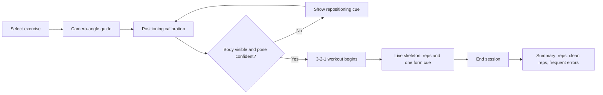
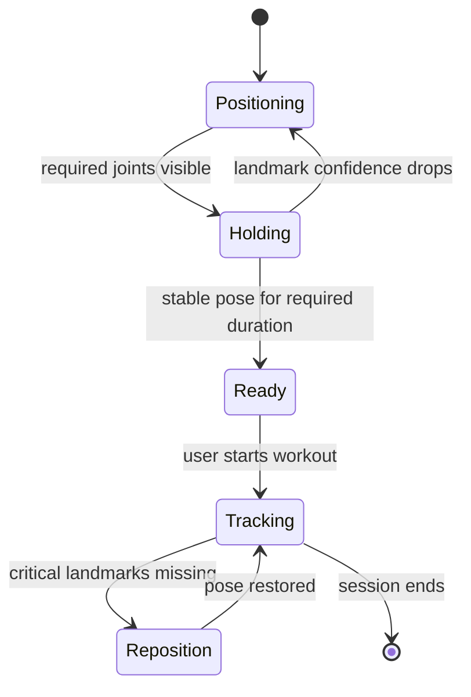
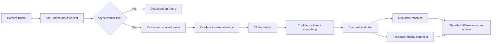
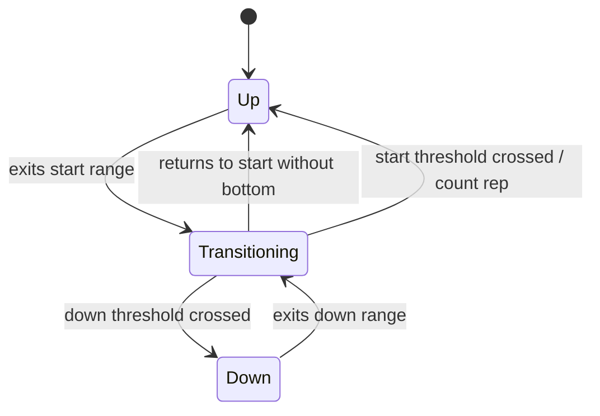

# GYM Pose AI — V2 Product & Technical Plan

> Research-informed implementation plan. V1 must optimize for reliable, privacy-preserving form feedback—not feature count.

## 1. Product thesis

GYM Pose AI is a privacy-first Hinglish fitness coach that uses a phone camera to count repetitions and give short, actionable form feedback in real time.

The primary user is a beginner or solo gym/home-workout user who wants help with three foundational movements without uploading workout video to a server.

### V1 promise

> Set up your phone, get your body in frame, and receive trustworthy rep counts plus one clear correction at a time.

### V1 constraints

- On-device inference only; no camera video upload or recording by default.
- Fitness guidance only; do not position the app as a medical, injury-diagnosis, rehabilitation, or clinical product.
- Feedback must be confidence-aware: an uncertain pose is **not** an incorrect form verdict.
- A supported camera angle is required for each exercise/rule.

## 2. Research-driven technical decisions

| Area                   | Decision                                                             | Why                                                                                                                                                      |
| ---------------------- | -------------------------------------------------------------------- | -------------------------------------------------------------------------------------------------------------------------------------------------------- |
| Expo workflow          | Expo development build / prebuild, never Expo Go                     | VisionCamera and local inference require native libraries.                                                                                               |
| Camera processing      | VisionCamera V5 `useFrameOutput` + AsyncRunner                       | Current VisionCamera uses frame output APIs; work must not block the camera thread.                                                                      |
| Frame overload         | Drop a frame when the async runner is busy                           | Smooth preview is more important than processing every frame.                                                                                            |
| Initial pose route     | Run a `react-native-fast-tflite` proof of concept first              | Its VisionCamera frame resizing/worklet path and Expo/CoreML configuration are documented.                                                               |
| Alternative pose route | Evaluate a thin native MediaPipe Pose Landmarker bridge in the spike | MediaPipe provides live-stream tracking, confidence controls, normalized/world coordinates and 33 landmarks; React Native integration must be validated. |
| UI updates             | Do not store raw landmarks in Zustand every frame                    | High-frequency pose data stays in native/worklet flow; UI receives throttled summaries only.                                                             |
| Feedback               | One highest-priority cue at a time, with 2–3 s cooldown              | Multiple or per-frame voice cues make coaching distracting.                                                                                              |

Sources: [Expo development builds](https://docs.expo.dev/develop/development-builds/introduction/), [VisionCamera frame output](https://visioncamera.margelo.com/docs/frame-output), [VisionCamera async processing](https://visioncamera.margelo.com/docs/async-frame-processing), [MediaPipe Pose Landmarker](https://developers.google.com/edge/mediapipe/solutions/vision/pose_landmarker), [react-native-fast-tflite](https://github.com/margelo/react-native-fast-tflite).

## 3. V1 user journey



### Screens

1. **Exercise selection** — squat, push-up, bicep curl; exercise-specific camera angle shown before starting.
2. **Camera setup & calibration** — silhouette/outline, distance and orientation instructions, landmark status.
3. **Live workout** — preview, skeleton, total reps, clean reps, form state, one feedback message, pause/end.
4. **Session summary** — total reps, clean-rep percentage, top errors and duration.
5. **Local history** — optional V1.1 screen for prior summary records; no video is retained.

## 4. Camera-angle policy

Single-camera 2D pose detection cannot reliably judge every movement property from every view. Rules must declare the view they require.

| Exercise / check  | Required V1 camera view      | Supported V1 checks                                  |
| ----------------- | ---------------------------- | ---------------------------------------------------- |
| Squat, side mode  | Side view                    | Knee/hip angle, depth proxy, torso/back lean         |
| Squat, front mode | Front view, future extension | Knee tracking / knee cave proxy                      |
| Push-up           | Side view                    | Elbow angle, body-line sag/pike, depth proxy         |
| Bicep curl        | Front or slight 45°          | Elbow flexion, incomplete ROM, upper-arm swing proxy |

### V1 decision

Ship **squat side mode only** initially. Do not claim knee-cave detection in this mode. Add a separate front-view squat analysis only after validation.

## 5. Calibration and confidence gate

Calibration is a product feature, not a cosmetic loading state.



### Calibration requirements

- Show the correct camera position before enabling Start.
- Verify expected landmarks for that exercise/view are visible.
- Require confidence above the exercise threshold for a short stable period.
- Optionally capture an upright/start-position baseline for personal angle calibration.
- During tracking, use an amber `reposition` status for occlusion, low light or incomplete body visibility.
- Never increment reps or log form errors during `reposition` / low-confidence periods.

## 6. Real-time inference pipeline



### Performance rules

- Start with a target processing rate of 15 FPS; camera preview may run faster independently.
- Downscale model input to the selected model’s required input resolution.
- Measure median and p95 inference time on physical target devices.
- Drop frames rather than queue them.
- Always dispose GPU-backed camera frames and resized buffers.
- Publish UI snapshots at a capped rate rather than at native camera FPS.

## 7. Exercise rule engine

Rules are data-driven. An exercise must be addable without editing generic camera, inference or rep-counting code.

```ts
type ExerciseConfig = {
  id: "squat-side" | "pushup-side" | "bicep-curl-front";
  name: string;
  targetMuscles: string[];
  requiredView: "side" | "front" | "three-quarter";
  requiredLandmarks: LandmarkName[];
  trackedAngles: AngleDefinition[];
  calibration: CalibrationRules;
  rep: RepThresholds;
  formChecks: FormCheck[];
  feedback: FeedbackMap;
};

type FormCheck = {
  id: string;
  severity: "major" | "minor";
  appliesInPhases: RepPhase[];
  evaluate: (pose: PoseSnapshot) => FormError | null;
};
```

### V1 form checks

| Exercise      | Rep signal             | Major feedback checks                       | Do not claim in V1               |
| ------------- | ---------------------- | ------------------------------------------- | -------------------------------- |
| Squat, side   | Hip/knee flexion cycle | Insufficient depth, major torso lean        | Knee cave from side view         |
| Push-up, side | Elbow flexion cycle    | Shallow depth, hip sag/pike                 | Fine shoulder/scapular diagnosis |
| Bicep curl    | Elbow flexion cycle    | Incomplete range, excessive upper-arm swing | Exact wrist/forearm biomechanics |

### Personalisation direction

Fixed universal angle limits are only a starting point. After calibration, calculate thresholds as a mixture of safe global limits and the user’s observed comfortable range of motion. Store these values locally per exercise and let a future settings screen reset them.

## 8. Rep counting state machine



### Rules

- A valid rep needs the full `up → down → up` sequence.
- Use separate enter and exit thresholds (hysteresis).
- Ignore frames below confidence requirements.
- Require minimum phase duration / movement amplitude to reject jitter.
- Count a **clean rep** only if no major form error persists in the evaluated portion of that rep.
- Keep total reps and clean reps separate.

## 9. Feedback system

### Visual states

- **Green:** tracked and current form checks pass.
- **Amber:** user must reposition, pose confidence is low, or the system is uncertain.
- **Red:** a high-confidence major form error is active.

### Voice rules

- Speak only on a high-priority error state change, rep milestone, or calibration transition.
- Minimum 2–3 second cooldown.
- No repeated cue while the same error remains active.
- Choose one cue by priority: safety/form > repositioning > encouragement.
- User setting: voice enabled, volume and language (Hinglish first, English optional).

### Initial cue set

| Error                  | Cue                               |
| ---------------------- | --------------------------------- |
| Body not fully visible | “Poora body frame mein lao.”      |
| Squat depth shallow    | “Thoda aur neeche jao.”           |
| Squat torso lean       | “Chest upar, peeth seedhi rakho.” |
| Push-up hip sag        | “Body ko seedha rakho.”           |
| Push-up shallow        | “Thoda aur neeche jao.”           |
| Curl swing             | “Elbow stable rakho.”             |

## 10. State, storage and privacy

### Zustand state

Zustand contains low-frequency workout/session state only:

```ts
type WorkoutState = {
  selectedExerciseId: string | null;
  mode: "setup" | "calibrating" | "ready" | "tracking" | "paused" | "finished";
  repPhase: "up" | "transitioning" | "down";
  totalReps: number;
  cleanReps: number;
  formStatus: "correct" | "warning" | "incorrect" | "unavailable";
  activeFeedback: string | null;
  sessionStartedAt: number | null;
};
```

### Local persistence

Persist only session summaries by default:

- Exercise, date, duration
- Total reps and clean reps
- Error counts and aggregated angles/ROM metrics
- User calibration settings

Do **not** persist camera frames or workout videos by default. If video recording is introduced later, require an explicit separate opt-in and explain retention/deletion.

### Store release checklist

- Clear in-app camera disclosure: live camera frames are processed on-device.
- Privacy policy accessible in app and store listing.
- Google Play Health Apps declaration and data-safety disclosure completed.
- Describe device compatibility and supported camera setup in store listing.
- Add a visible non-medical disclaimer: persistent pain, injuries and rehabilitation need a qualified professional.

Policy references: [Google Play Health Content and Services](https://support.google.com/googleplay/android-developer/answer/16679511?hl=en-GB), [Apple App Review Guidelines](https://developer.apple.com/app-store/review/guidelines/).

## 11. Source structure

```text
src/
  app/
    index.tsx
    setup.tsx
    workout.tsx
    summary.tsx
    history.tsx
  components/
    CameraPlacementGuide.tsx
    CalibrationOverlay.tsx
    SkeletonOverlay.tsx
    FormStatusIndicator.tsx
    RepCounter.tsx
  features/
    camera/
      frameOutput.ts
      coordinateTransform.ts
    pose/
      types.ts
      inference.ts
      landmarks.ts
      confidence.ts
      smoothing.ts
      angleMath.ts
      skeleton.ts
    exercises/
      types.ts
      evaluator.ts
      squatSide.ts
      pushupSide.ts
      bicepCurlFront.ts
    workout/
      calibration.ts
      repCounter.ts
      feedbackPriority.ts
      voiceCues.ts
      sessionStats.ts
  store/
    workoutStore.ts
  storage/
    sessionRepository.ts
```

## 12. Milestone plan

### M0 — Environment validation

- Initialise Expo TypeScript app with Expo Router and development build support.
- Add native dependencies and build a real Android dev client.
- Confirm camera permissions and physical-device preview.

**Gate:** Android development build launches and displays a live camera preview.

### M1 — Native pose spike

- Integrate VisionCamera V5 frame output and async processing.
- Integrate `react-native-fast-tflite` plus a compatible local pose model.
- Resize camera frames, infer landmarks, measure latency, and safely dispose buffers.
- Evaluate MediaPipe bridge feasibility in parallel only if needed.

**Gate:** One physical target device yields stable 33-landmark output at a usable processed FPS without camera/UI stalls.

### M2 — Calibration, coordinate mapping and skeleton

- Transform normalized inference coordinates into preview coordinates, including orientation and front-camera mirroring.
- Render landmark/skeleton overlay.
- Implement side-view squat calibration and confidence gate.

**Gate:** Overlay aligns to body and no workout can begin until required joints are visible and stable.

### M3 — Squat vertical slice

- Implement angle maths, side-squat config and rep state machine.
- Add depth and torso-lean checks.
- Add green/amber/red feedback, one Hinglish cue and summary results.

**Gate:** Squats produce reliable total/clean reps from representative recorded and real-device test sessions.

### M4 — Push-up and curl

- Add side-view push-up config and tests.
- Add front/three-quarter bicep-curl config and tests.
- Reuse the generic calibration, evaluator, counter and feedback systems.

**Gate:** All three exercises work without exercise-specific screen implementations.

### M5 — Persistence, UX and release readiness

- Save local summaries/history.
- Add settings for voice and language.
- Complete permission, privacy and disclaimer UX.
- Perform device, lighting, orientation and interruption QA.

**Gate:** A user can complete and review a workout offline with no video leaving the device.

## 13. Quality metrics

Track these during development:

| Category       | Metric                                                                     |
| -------------- | -------------------------------------------------------------------------- |
| Responsiveness | Processed FPS, preview smoothness, median/p95 inference duration           |
| Reliability    | Rep-count agreement against manually labelled workout videos               |
| Safety         | Percentage of low-confidence periods incorrectly labelled as bad form      |
| Feedback       | Duplicate voice cues per minute; cue-to-correction response during testing |
| UX             | Calibration completion rate; sessions abandoned before first rep           |

## 14. Test strategy

- Unit tests: angle math, smoothing, confidence gates, hysteresis and all state transitions.
- Fixture tests: labelled landmark sequences for valid reps, partial reps, jitter, occlusion and major errors.
- Device QA: Android first, then iOS; test lighting, phone placement, body size, clothing contrast and camera orientation.
- Manual trainer review: validate only the small set of shipped form claims before presenting them as feedback.
- Regression library: save anonymised landmark sequences—not video by default—for each fixed bug.

## 15. Non-goals until V1 is validated

- AI-generated workout programmes
- Cloud sync, account system and social sharing
- Live video storage/replay
- Medical/rehabilitation claims
- Automatic exercise recognition
- Advanced features such as velocity-based training, 1RM estimation or bilateral-symmetry scores

## 16. Definition of done

V1 is ready when a user with a supported phone can:

1. Select squat-side, push-up-side or bicep-curl-front mode.
2. Follow a camera placement guide and pass landmark-based calibration.
3. See a correctly aligned skeleton overlay and understandable form status.
4. Receive non-spammy Hinglish voice feedback only for high-confidence events.
5. Get reliable `up → down → up` rep counts and separate clean-rep totals.
6. Finish offline and review a local session summary without their workout video being stored or uploaded.
