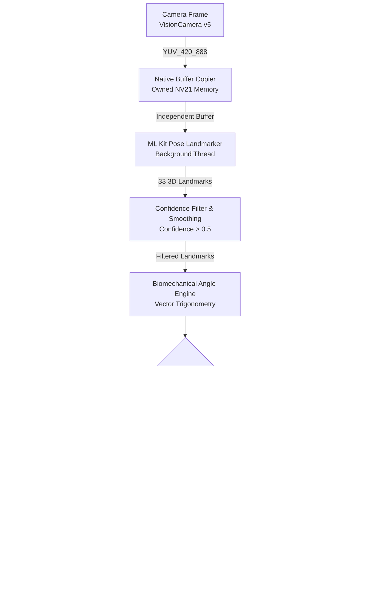

# GYM Pose AI 🏋️‍♂️🤖

<div align="center">

[](https://opensource.org/licenses/MIT)
[](https://expo.dev/)
[](https://reactnative.dev/)
[](https://www.typescriptlang.org/)
[-3DDC84.svg?logo=android&logoColor=white>)](https://developer.android.com/)
[](CONTRIBUTING.md)

**Real-time on-device Edge AI workout coach and biomechanical form corrector.**

[Features](#-key-features) • [Architecture](#-system-architecture) • [Exercises](#-supported-exercises) • [Tech Stack](#-tech-stack) • [Getting Started](#-getting-started) • [Native Stability](#-native-stability--crash-prevention) • [Contributing](#-contributing)

</div>

---

## 📌 Overview

**GYM Pose AI** is a production-grade mobile application built with React Native and Expo (dev-client) that provides real-time biomechanical exercise feedback using on-device computer vision.

By tracking 33 3D body keypoints directly on-chip with zero cloud round-trips, GYM Pose AI calculates anatomical joint angles, enforces biomechanical movement criteria, accurately counts repetitions via hysteresis state machines, and provides instant audio-visual guidance to prevent workout injuries.

```
       [Camera Feed] ──▶ [Edge ML Inference (30 FPS)] ──▶ [Biomechanical Rules]
                                                                  │
              ┌───────────────────────────────────────────────────┴───────────────────────┐
              ▼                                                                           ▼
   [Dynamic HUD Skeleton]                                                        [Real-time Audio Coach]
(Green = Correct | Red = Fault)                                                ("Keep back straight", etc.)
```

---

## ✨ Key Features

- **⚡ 100% On-Device Inference:** Zero latency, zero cloud upload, complete user privacy. Runs real-time frame processing at 20–30 FPS on mobile hardware.
- **📐 33 Keypoint Pose Landmarker:** Tracks full-body anatomy (shoulders, elbows, wrists, hips, knees, ankles, feet) in 3D normalized coordinates.
- **🦾 Biomechanical Trigonometric Engine:** Computes exact interior joint angles using 3D Euclidean vector math ($\arccos$ dot products) and checks against physiological movement standards.
- **🔄 Fault-Tolerant Rep Counting:** State machine (`UP` $\rightarrow$ `TRANSITIONING` $\rightarrow$ `DOWN` $\rightarrow$ `UP`) with hysteresis thresholds prevents double-counting and partial-rep cheating.
- **🎯 Dynamic AR Skeleton HUD:** High-visibility SVG skeleton overlay drawn over the live camera preview with instant color feedback (Green for good form, Red for detected faults).
- **🔊 Smart Audio Coaching:** Low-latency voice cues (powered by `expo-speech`) triggered dynamically upon form degradation, governed by cooldown suppression to avoid repetitive spam.
- **🛡️ Rock-Solid Native Memory Safety:** Features an owned NV21 byte-buffer cloning architecture to eliminate Android Camera2 / ML Kit `SIGSEGV` memory corruption crashes.
- **📊 Session Analytics & History:** Detailed post-workout breakdown with form accuracy percentage, primary mistakes encountered, and local persistence via AsyncStorage.

---

## 🏗️ System Architecture



---

## 🏋️ Supported Exercises

| Exercise           | Primary Tracked Angles                 | Ideal Rep Criteria                                                  | Form Faults Monitored                                            |
| :----------------- | :------------------------------------- | :------------------------------------------------------------------ | :--------------------------------------------------------------- |
| **Squats** 🦵      | Hip-Knee-Ankle & Torso Verticality     | Down: Knee $\le 90^\circ$<br>Up: Knee $\ge 160^\circ$               | • Knees caving inward (valgus)<br>• Excessive torso forward lean |
| **Push-ups** 💪    | Shoulder-Elbow-Wrist & Hip-Spine Plank | Down: Elbow $\le 90^\circ$<br>Up: Elbow $\ge 160^\circ$             | • Sagging hips / arched lower back<br>• Incomplete arm lockout   |
| **Bicep Curls** 🏋️ | Shoulder-Elbow-Wrist & Elbow Flare     | Contracted: Elbow $\le 50^\circ$<br>Extended: Elbow $\ge 150^\circ$ | • Swinging elbows away from torso<br>• Partial range of motion   |

_The exercise engine is fully modular (`src/features/exercises/config.ts`) — adding new exercises requires only defining joint indices and angular threshold rules._

---

## 💻 Tech Stack

- **Framework:** [React Native 0.86](https://reactnative.dev/) with [Expo SDK 57](https://expo.dev/) (Dev Client workflow)
- **Language:** [TypeScript 6.0](https://www.typescriptlang.org/)
- **Navigation:** [Expo Router](https://docs.expo.dev/router/introduction/) (File-based routing)
- **Computer Vision:** [react-native-vision-camera v5](https://mrousavy.com/react-native-vision-camera/)
- **Native Pose Engine:** [react-native-nitro-pose-exercises](https://github.com/) & [react-native-nitro-modules](https://nitro.margelo.com/)
- **Pose Detection Model:** Google ML Kit Pose Detection (Accurate Landmarker, 33 3D keypoints)
- **State Management:** [Zustand](https://github.com/pmndrs/zustand)
- **Styling:** [NativeWind v4](https://www.nativewind.dev/) (Tailwind CSS for React Native)
- **Audio Feedback:** [Expo Speech](https://docs.expo.dev/versions/latest/sdk/speech/)
- **Graphics & HUD:** [react-native-svg](https://github.com/software-mansion/react-native-svg) & [react-native-reanimated](https://docs.swmansion.com/react-native-reanimated/)

---

## 🛡️ Native Stability & Crash Prevention

Running deep learning pose inference on live camera streams often triggers `SIGSEGV` or buffer race conditions when the camera driver reuses or deallocates memory planes before inference finishes.

GYM Pose AI resolves this with custom native hardening:

1. **Independent NV21 Memory Cloning:** Camera YUV frames are copied into an owned, heap-allocated NV21 byte buffer before handing them to asynchronous ML Kit tasks. The camera frame is released immediately.
2. **Atomic Single-Inference Queue:** At most one frame is in-flight at any time. Stale frames from previous reps or paused states are discarded deterministically.
3. **Automated Gradle & Runtime Hot-Patches:** Automated postinstall scripts (`scripts/patch-nitro-pose-gradle.cjs` and `scripts/patch-nitro-pose-runtime.cjs`) apply critical patches automatically upon `npm install`.
4. **Verified Buffer Unit Tests:** A dedicated Java/Kotlin test harness (`scripts/test-pose-buffers.cjs`) verifies memory offsets, row padding, and chroma pixel strides across 8 distinct hardware sensor layouts.

---

## 🚀 Getting Started

### Prerequisites

- **Node.js:** `>= 18.x`
- **Package Manager:** `npm` or `yarn`
- **Android Development Environment:**
  - Android Studio with Android SDK Platform 34+
  - JDK 17
  - Physical Android device with USB debugging enabled (recommended; camera feed required for real-time tracking)

### Installation

1. **Clone the repository:**

   ```bash
   git clone https://github.com/som2077/gym-pose-AI.git
   cd gym-pose-AI
   ```

2. **Install dependencies:**

   ```bash
   npm install
   ```

   _(This automatically executes the `postinstall` script to apply the native Nitro Pose memory fixes)._

3. **Verify the installation:**

   ```bash
   npm test
   npm run typecheck
   ```

4. **Run on Android:**
   Connect your physical Android device via USB (`adb devices`) and execute:
   ```bash
   npm run android
   ```
   _Note: Standard Expo Go cannot be used because this application relies on high-speed custom C++/Kotlin native frame processors._

---

## 📁 Project Structure

```
gym-pose-AI/
├── .github/                      # GitHub Actions CI & Issue/PR templates
│   ├── workflows/ci.yml          # Automated CI pipeline (typecheck + tests)
│   ├── ISSUE_TEMPLATE/           # Bug report & feature request forms
│   └── PULL_REQUEST_TEMPLATE.md  # Standardized PR template
├── app/                          # Expo Router screens
│   ├── _layout.tsx               # Root layout & navigation providers
│   ├── index.tsx                 # Home / Exercise selection screen
│   ├── setup.tsx                 # Camera placement guide & device setup
│   ├── workout.tsx               # Live camera workout screen
│   ├── summary.tsx               # Post-workout session summary
│   └── history.tsx               # Workout history & metrics log
├── src/
│   ├── components/               # Reusable UI & HUD components
│   │   ├── WorkoutCamera.tsx     # VisionCamera wrapper with lifecycle hooks
│   │   ├── PoseSkeleton.tsx      # SVG live skeleton overlay renderer
│   │   ├── CameraPlacementGuide.tsx # Alignment framing guide
│   │   ├── PrimaryButton.tsx     # Reusable design-system button
│   │   └── Screen.tsx            # Safe-area layout container
│   ├── features/
│   │   ├── pose/                 # Math & pose landmarker logic
│   │   │   ├── angleMath.ts      # 3D vector geometry & interior angle calculations
│   │   │   ├── confidence.ts     # Landmark thresholding & validation
│   │   │   └── types.ts          # Keypoint & geometric types
│   │   ├── exercises/            # Config-driven exercise rules engine
│   │   │   ├── config.ts         # Squat, push-up, curl specifications & thresholds
│   │   │   └── types.ts          # Exercise definition schemas
│   │   └── workout/              # Workout business logic
│   │       ├── repCounter.ts     # Dual-hysteresis state machine
│   │       └── voiceCues.ts      # Speech synthesis manager with cooldown
│   ├── storage/                  # Local persistence (AsyncStorage sessions)
│   └── store/                    # Zustand global application state
├── scripts/                      # Native patches and buffer test harness
│   ├── patch-nitro-pose-gradle.cjs   # Native Android Gradle configuration patch
│   ├── patch-nitro-pose-runtime.cjs  # Runtime memory safety patch
│   └── test-pose-buffers.cjs         # YUV/NV21 buffer verification test suite
└── docs/                         # In-depth architectural & stability documentation
    └── pose-camera-fix.md        # Technical explanation of native buffer fix
```

---

## 🧪 Available Scripts

| Command                     | Description                                                               |
| :-------------------------- | :------------------------------------------------------------------------ |
| `npm run start`             | Starts the Metro bundler for the Expo Dev Client                          |
| `npm run android`           | Compiles native Android code and installs debug build on connected device |
| `npm run typecheck`         | Validates all TypeScript types with `tsc --noEmit`                        |
| `npm test`                  | Executes native YUV/NV21 buffer memory layout tests                       |
| `npm run test:pose-buffers` | Runs the 8-layout Kotlin buffer verification harness                      |

---

## 🗺️ Roadmap

- [x] On-device 33-point pose landmarking via ML Kit
- [x] Vector trigonometry joint angle calculation engine
- [x] Config-driven exercise rules for Squats, Push-ups, and Bicep Curls
- [x] Dual-hysteresis rep-counting state machine
- [x] Dynamic color-coded AR skeleton overlay HUD
- [x] Audio coaching feedback with intelligent cooldowns
- [x] Native YUV/NV21 memory safety patch preventing SIGSEGV crashes
- [x] Session history & summary tracking with local storage
- [ ] iOS Vision Camera frame processor support
- [ ] Additional exercises: Lunges, Shoulder Press, Planks
- [ ] Target rep goals & countdown timer modes
- [ ] Offline exportable workout analytics (JSON/CSV)

---

## 🤝 Contributing

Contributions are welcome! Please read our **[Contributing Guidelines](CONTRIBUTING.md)** and review the **[Code of Conduct](CODE_OF_CONDUCT.md)** before submitting pull requests.

1. Fork the repository
2. Create your feature branch (`git checkout -b feat/new-exercise`)
3. Ensure typecheck and tests pass (`npm run typecheck && npm test`)
4. Commit your changes (`git commit -m "feat: add dumbbell lunge exercise configuration"`)
5. Push to your branch (`git push origin feat/new-exercise`)
6. Open a Pull Request

---

## 📄 License

This project is licensed under the MIT License - see the [LICENSE](LICENSE) file for details.

---

## 👤 Author

**som2077**

- GitHub: [@som2077](https://github.com/som2077)
- Email: [somgautam2077@gmail.com](mailto:somgautam2077@gmail.com)

---

<div align="center">
⭐ Star this repository if you find it helpful!
</div>
